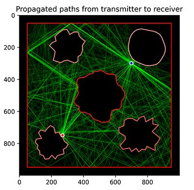
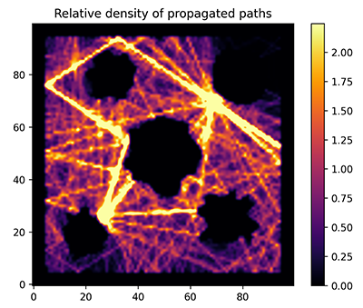

# multipatprop 🔆

Multipath propagation simulation using ray-casting method.


[Image Source](https://www.researchgate.net/profile/Md-Maruf-Ahamed/publication/306113486/figure/fig1/AS:405599469752320@1473713857593/Multipath-propagation-in-outdoor-scenario.png)

Image Citation: Ahamed, Md. Maruf & Faruque, Saleh. (2016). Propagation factors affecting the performance of 5G millimeter wave radio channel. 0728-0733. 10.1109/EIT.2016.7535329.

## Usage

To install dependencies
```
pip install -r requirements.txt
```
To run a demonstrating script
```
python multipatprop/<mpp_example>
```
where `<mpp_example>` is the file name of the program you want to run.

## Algorithm

Transmitter sends signals in every direction with a finite number of starting paths.
Receiver collects all the propagated paths (paths that made it to the receiver) and records them as a group.
Propagated paths are determined by whether the signals reach within a certain distance of the receiver.
The signal may bounce off multiple reflective interferers and will still be labeled as propagated.
However, every collision the signal makes with an interferer, the energy of the signal decays exponentially.

The algorithm described above allows us to make a visualization of all the paths that reach the target.

To make the time energy graph, which describes the rate of energy in relation to time (non-cumulative) received by the receiver from any of the possible directions within a range of time,
the variable time is rounded into bins such that for every path propagated, the energy of the bin with the corresponding travel time is then incremented by the final energy of the wave.

## Applicability

The simulation may be loosely used to model an urban environment from the perspective of a birds eye view. Specifically, the interferers may behave as the radio wave reflecting city blocks, the transmitter as the emitting cell phone tower and the receiver as the wireless carrier. In a particular scenario where the transmitter and receiver share a common location, the propagated paths of the transmitter can be said to be a rough approximation of the radar emissions of a ground search radar.

From the way the simulation was designed, modelled are the known multipath phenomena of fading, delay, interference and ghosting.

## Gallery

### City Example


### Blobs Example




