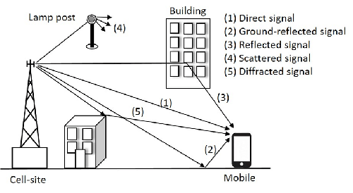
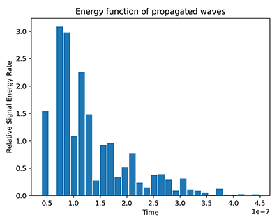

# multipatprop 🔆

Multipath propagation simulation using ray-casting method and finite element analysis.



## Usage

To install dependencies
```
pip install -r requirements.txt
```
To run a demonstrating script
```
python multipatprop/mpp_example
```
where `example` is the remainder file name of the program you want to run.

## Algorithm

Transmitter sends signals in every direction with a limited number of starting paths.
Receiver collects all the propagated paths (paths that made it to the receiver) and records the data of these.
Propagated path is determined by whether the signal reaches within a certain distance of the receiver.
The signals may bounce off of reflective interferers and will still count as propagated.
However, every collision the signal makes with an interferer, the energy of the signal decays exponentially.

The algorithm described above allows us to make a visualization of all the paths that reach the target.

To make the time energy graph, which describes the rate of energy (non-cumulative) received by the receiver from all directions at any time,
the time is separated into bars and for every path propagated, the bar with the corresponding travel time is selected and is incremented by the final energy of the wave.

## Applicability

In an urban environment, the interferers may act as the city blocks, the transmitter as the cell tower and the receiver as the phone. In a special case scenario where the transmitter and receiver are on the same position, the results can be treated as coming from a search radar.

From the way the simulation is designed, modelled are the known multipath effects of ghosting, fading, delay, and interference.

## Gallery

### City Example


### Blobs Example




